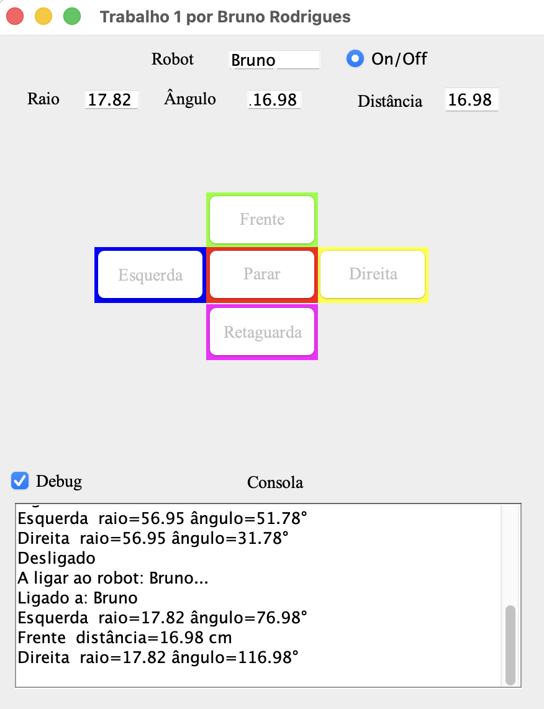
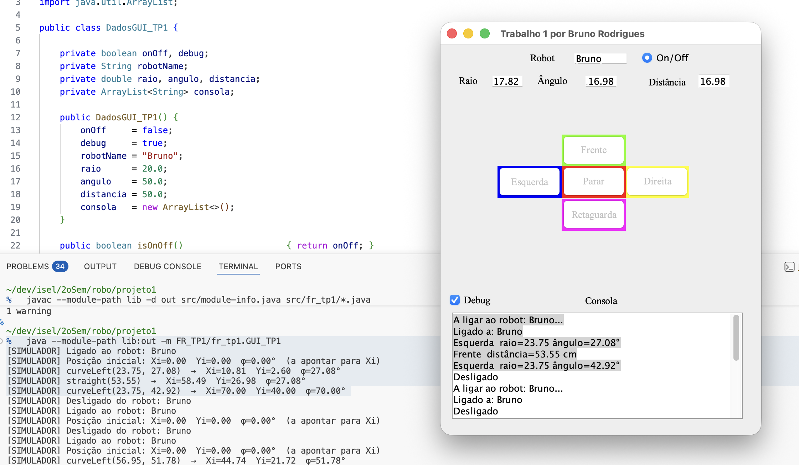
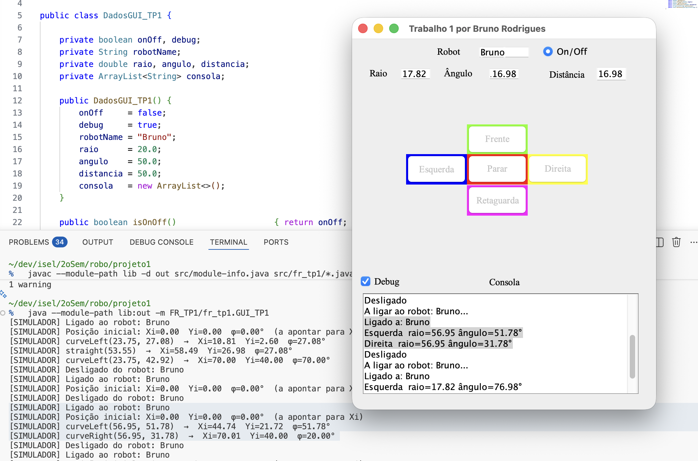
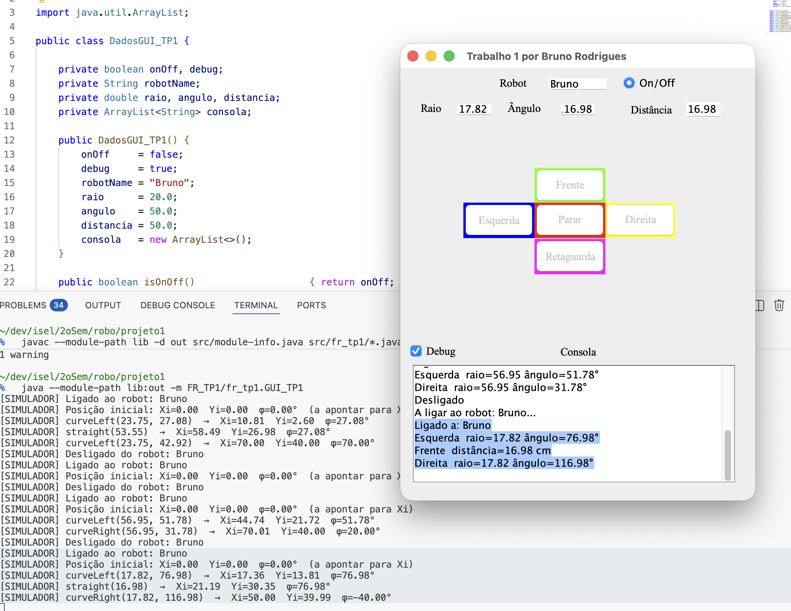

# Relatório — 1º Trabalho Prático  
**Fundamentos de Robótica** | MEIM/MEET | 2º Sem 2025/2026  
**Autor:** Bruno Rodrigues  
**Docente:** Jorge Pais

---

## 1. Introdução

A robótica é uma área interdisciplinar que combina mecânica, eletrónica, sensores e algoritmos de controlo para criar máquinas capazes de interagir com o ambiente de forma autónoma ou teleoperada. No contexto académico, o robot didático Lego EV3 permite explorar estes conceitos de forma prática e acessível.

Este trabalho prático tem como objetivo o desenvolvimento de uma aplicação Java para controlar o robot Lego EV3 à distância via Bluetooth. O trabalho divide-se em duas partes complementares: primeiro, o desenvolvimento de uma interface gráfica em Swing que permita ao utilizador enviar comandos de movimento ao robot; segundo, a implementação de uma classe `myRobotLego` que traduz esses comandos de alto nível em instruções diretas para os motores do EV3, recorrendo à biblioteca `InterpretadorEV3.jar`.

Uma vez que a ligação Bluetooth não estava disponível durante o desenvolvimento, foi também implementado um simulador de terminal que replica a cinemática real do robot, permitindo verificar a correção dos movimentos antes de os executar no hardware físico. O simulador segue o sistema de coordenadas definido pelo professor nos slides da disciplina (eixo Xi vertical, eixo Yi horizontal para a esquerda, ângulo φ medido a partir de Xi no sentido anti-horário), e foi validado com os três exemplos de trajetórias apresentados nas aulas.

---

## 2. Objetivo

Desenvolvimento de uma interface gráfica em Java Swing para controlar o robot didático Lego EV3 via Bluetooth, composta por duas partes:

1. **GUI funcional** com simulador de terminal para teste local
2. **Classe `myRobotLego`** que implementa os movimentos usando a biblioteca `InterpretadorEV3.jar`

---

## 3. Como Compilar e Executar

### Pré-requisitos
- Java 11 ou superior (`java --version`)
- Estar dentro da pasta `projeto1/`

### Compilar

```bash
cd projeto1
javac --module-path lib -d out src/module-info.java src/fr_tp1/*.java
```

### Executar a GUI

```bash
java --module-path lib:out -m FR_TP1/fr_tp1.GUI_TP1
```

### Usar com o Robot Real (quando Bluetooth disponível)

Em `GUI_TP1.java`, substituir a linha do campo `robot`:

```java
// Simulador (por defeito):
private IRobot robot = new SimuladorRobot();

// Robot real:
private IRobot robot = new myRobotLego();
```

---

## 4. Estrutura de Ficheiros

```
projeto1/
├── lib/
│   ├── RobotLegoEV32026.jar          # biblioteca high-level do EV3
│   ├── InterpretadorEV32026.jar      # API low-level de motores/sensores
│   └── bluecove-2.1.1-SNAPSHOT.jar  # stack Bluetooth
└── src/
    ├── module-info.java
    └── fr_tp1/
        ├── IRobot.java               # interface comum
        ├── DadosGUI_TP1.java         # modelo de dados da GUI
        ├── SimuladorRobot.java       # simulador de terminal
        ├── myRobotLego.java          # robot real (InterpretadorEV3)
        └── GUI_TP1.java              # janela principal (Swing)
```

---

## 5. Descrição das Classes

### 5.1 `IRobot` — Interface Comum

Define o contrato que tanto o simulador como o robot real implementam:

```java
boolean ligar(String nome);
void desligar();
void reta(double distancia);
void recuar(double distancia);
void curvarEsquerda(double raio, double angulo);
void curvarDireita(double raio, double angulo);
void parar(boolean travar);
void setVelocidade(int vel);
boolean isLigado();
```

Esta interface permite trocar o simulador pelo robot real sem alterar a GUI — basta mudar a instância do campo `robot` em `GUI_TP1.java`.

---

### 5.2 `DadosGUI_TP1` — Modelo de Dados

Classe de dados (POJO) que guarda os valores iniciais dos campos da GUI:

| Campo | Tipo | Valor inicial | Descrição |
|-------|------|--------------|-----------|
| `robotName` | `String` | `"Bruno"` | Nome Bluetooth do robot |
| `raio` | `double` | `20.0` | Raio de curvatura (cm) |
| `angulo` | `double` | `50.0` | Ângulo de curvatura (graus) |
| `distancia` | `double` | `50.0` | Distância em linha reta (cm) |
| `debug` | `boolean` | `true` | Estado inicial da checkbox Debug |
| `onOff` | `boolean` | `false` | Estado inicial do botão On/Off |

---

### 5.3 `SimuladorRobot` — Simulador de Terminal

Implementa `IRobot` simulando os movimentos no terminal. Mantém um estado cinemático interno com posição `(Xi, Yi)` e orientação `φ`, seguindo o sistema de coordenadas dos slides do professor:

- **Xi**: eixo vertical (para cima) — direção inicial do robot (φ=0°)
- **Yi**: eixo horizontal (para a esquerda)
- **φ positivo**: robot virou para a esquerda (sentido anti-horário)
- **φ negativo**: robot virou para a direita (sentido horário)

#### Cinemática implementada

**straight(d)** — desloca o robot na direção do rumo atual:

```
Xi += d × cos(φ)
Yi += d × sin(φ)
```

**curveLeft(r, α)** — arco anti-horário, centro à esquerda do robot:

```
Xi += r × (sin(φ + α) − sin(φ))
Yi += r × (cos(φ) − cos(φ + α))
φ  += α
```

**curveRight(r, α)** — arco horário, centro à direita do robot:

```
Xi += r × (sin(φ) − sin(φ − α))
Yi += r × (cos(φ − α) − cos(φ))
φ  -= α
```

O ângulo φ é normalizado para o intervalo (−180°, 180°] após cada movimento.

---

### 5.4 `myRobotLego` — Robot Real

Implementa `IRobot` usando `InterpretadorEV3`. Controla os motores B (esquerdo) e C (direito) do EV3.

#### Parâmetros físicos

| Parâmetro | Valor |
|-----------|-------|
| Diâmetro das rodas | 5,6 cm |
| Circunferência das rodas | π × 5,6 ≈ 17,59 cm |
| Distância entre rodas (dbw) | 9,5 cm |
| Velocidade base | 40% |
| Velocidade do motor a 100% | 720°/s ≈ 35,2 cm/s |

#### Cálculo do tempo de execução

Para percorrer uma distância `d` cm à velocidade `v`%:

```
cmPerSec = (v / 100) × 720 × (circunferência / 360)
tempo_ms  = (d / cmPerSec) × 1000
```

A execução segue o padrão: `OnFwd` → `Thread.sleep(tempo_ms)` → `Off`.

#### Cinemática das curvas

Para uma curva à esquerda com raio `r` e ângulo `α`:

```
raio_exterior (roda C) = r + dbw/2
raio_interior (roda B) = r − dbw/2

vel_exterior = velocidade_base
vel_interior = velocidade_base × (raio_interior / raio_exterior)
```

Se `vel_interior < 0` (curva muito fechada), a roda interior usa `OnRev`. Para curva à direita, os motores B e C trocam de papel.

---

### 5.5 `GUI_TP1` — Interface Gráfica

Janela principal criada com o editor WindowBuilder do Eclipse. Usa **null layout** (posicionamento absoluto).



Componentes principais:

| Componente | Tipo Swing | Função |
|-----------|-----------|--------|
| `textField_Robot` | `JTextField` | Nome Bluetooth do robot |
| `rdbtnOnoff` | `JRadioButton` | Liga/desliga comunicação |
| `textField_Raio` | `JTextField` | Raio de curvatura (cm) |
| `textField_Angulo` | `JTextField` | Ângulo de curvatura (°) |
| `textField_Distancia` | `JTextField` | Distância em linha reta (cm) |
| `JButtton_Frente` | `JButton` (verde) | Movimento para a frente |
| `JButtton_Retaguarda` | `JButton` (magenta) | Movimento para trás |
| `JButtton_Esquerda` | `JButton` (azul) | Curva à esquerda |
| `JButtton_Direita` | `JButton` (amarelo) | Curva à direita |
| `JButtton_Parar` | `JButton` (vermelho) | Parar o robot |
| `chckbxDebug_1` | `JCheckBox` | Ativa mensagens na consola da GUI |
| `textArea` | `JTextArea` | Consola de log |

#### Gestão de threads — SwingWorker

Os comandos do robot correm em `SwingWorker` para não congelar a EDT do Swing. Os botões de movimento são desativados durante a execução e reativados no final:

```java
private void executarComando(Runnable cmd) {
    setBotoesMovimento(false);
    new SwingWorker<Void, Void>() {
        @Override protected Void doInBackground() { cmd.run(); return null; }
        @Override protected void done()           { setBotoesMovimento(true); }
    }.execute();
}
```

#### Consola de log

- `myPrint(msg)` — só escreve se a checkbox **Debug** estiver ativa
- `myPrintSempre(msg)` — escreve sempre (mensagens de ligação/erro)

---

## 6. Diagrama de Arquitectura

```
┌─────────────────────────────────────────┐
│              GUI_TP1 (JFrame)           │
│                                         │
│  [Robot: Bruno]      [● On/Off]         │
│  [Raio: 20] [Ângulo: 50] [Distância:50] │
│                                         │
│         [  Frente  ]                    │
│  [Esquerda] [Parar] [Direita]           │
│         [Retaguarda]                    │
│                                         │
│  [✓ Debug]         Consola              │
│  ┌─────────────────────────────────┐    │
│  │ Ligado a: Bruno                 │    │
│  └─────────────────────────────────┘    │
└────────────────┬────────────────────────┘
                 │ IRobot
        ┌────────┴────────┐
        │                 │
 SimuladorRobot     myRobotLego
 (terminal)         (InterpretadorEV3)
                         │
                   [Motor B] [Motor C]
                   esquerdo  direito
```

---

## 7. Validação com as Trajetórias do Professor

O simulador foi validado com os três exemplos de trajetórias apresentados nos slides da disciplina. O sistema de coordenadas usado (Xi cima, Yi esquerda, φ medido a partir de Xi) é o mesmo dos slides.

### Trajetória 1 — ponto (70, 40, φ=70°)

| Passo | Raio | Ângulo | Distância | Botão |
|-------|------|--------|-----------|-------|
| 1 | 23.75 | 27.08 | — | Esquerda |
| 2 | — | — | 53.55 | Frente |
| 3 | 23.75 | 42.92 | — | Esquerda |



✓ Resultado: **Xi=70.00  Yi=40.00  φ=70.00°**

---

### Trajetória 2 — ponto (70, 40, φ=20°)

| Passo | Raio | Ângulo | Distância | Botão |
|-------|------|--------|-----------|-------|
| 1 | 56.95 | 51.78 | — | Esquerda |
| 2 | 56.95 | 31.78 | — | Direita |



✓ Resultado: **Xi=70.01  Yi=40.00  φ=20.00°** (desvio de 0.01 cm por arredondamento dos parâmetros)

---

### Trajetória 3 — ponto (50, 40, φ=−40°)

| Passo | Raio | Ângulo | Distância | Botão |
|-------|------|--------|-----------|-------|
| 1 | 17.82 | 76.98 | — | Esquerda |
| 2 | — | — | 16.98 | Frente |
| 3 | 17.82 | 116.98 | — | Direita |



✓ Resultado: **Xi=50.00  Yi=39.99  φ=−40.00°** (desvio de 0.01 cm por arredondamento dos parâmetros)

---

Os pequenos desvios (≤ 0.01 cm) devem-se ao arredondamento dos parâmetros apresentados nos slides. Em contexto real, os erros do hardware (deslizamento das rodas, irregularidades do piso) são significativamente maiores, pelo que estes desvios são negligenciáveis.

---

## 8. Conclusão

O trabalho prático foi concluído com sucesso, cumprindo os dois objetivos definidos no enunciado.

Na **Parte 1**, foi desenvolvida uma interface gráfica em Java Swing com todos os elementos requeridos: campos para o nome do robot, raio, ângulo e distância; cinco botões de movimento (Frente, Retaguarda, Esquerda, Direita, Parar); botão On/Off para gerir a ligação Bluetooth; checkbox de Debug; e consola de log em tempo real. A GUI foi implementada com `SwingWorker` para garantir que as operações do robot não bloqueiam a EDT, mantendo a interface responsiva durante a execução dos comandos.

Para permitir o desenvolvimento e teste sem acesso ao robot físico, foi criado um **simulador de terminal** (`SimuladorRobot`) que reproduz fielmente a cinemática do robot, usando o sistema de coordenadas do professor (Xi, Yi, φ). O simulador foi validado com as três trajetórias de referência dos slides, obtendo resultados coincidentes com os valores teóricos.

Na **Parte 2**, foi implementada a classe `myRobotLego` usando a biblioteca `InterpretadorEV3.jar`. A classe calcula os tempos de execução a partir dos parâmetros físicos do robot (diâmetro das rodas, distância entre rodas) e implementa a cinemática diferencial das curvas, atribuindo velocidades distintas às rodas interior e exterior em função do raio de curvatura pretendido.

A utilização de uma interface comum (`IRobot`) permite substituir o simulador pelo robot real com uma única alteração no código, sem modificar a lógica da GUI.
